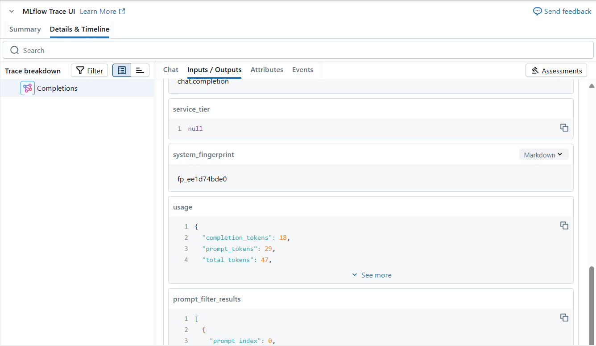

---
lab:
    title: 'Implement LLMOps with Azure Databricks'
---

# Implement LLMOps with Azure Databricks

Azure Databricks provides a unified platform that streamlines the AI lifecycle, from data preparation to model serving and monitoring, optimizing the performance and efficiency of machine learning systems. It supports the development of generative AI applications, leveraging features like Unity Catalog for data governance, MLflow for model tracking, and Mosaic AI Model Serving for deploying LLMs.

This lab will take approximately **20** minutes to complete.

> **Note**: The Azure Databricks user interface is subject to continual improvement. The user interface may have changed since the instructions in this exercise were written.

## Before you start

You'll need an [Azure subscription](https://azure.microsoft.com/free) in which you have administrative-level access.

## Provision an Azure OpenAI resource

If you don't already have one, provision an Azure OpenAI resource in your Azure subscription.

1. Sign into the **Azure portal** at `https://portal.azure.com`.
2. Create an **Azure OpenAI** resource with the following settings:
    - **Subscription**: *Select an Azure subscription that has been approved for access to the Azure OpenAI service*
    - **Resource group**: *Choose or create a resource group*
    - **Region**: *Make a **random** choice from any of the following regions*\*
        - East US 2
        - North Central US
        - Sweden Central
        - Switzerland West
    - **Name**: *A unique name of your choice*
    - **Pricing tier**: Standard S0

> \* Azure OpenAI resources are constrained by regional quotas. The listed regions include default quota for the model type(s) used in this exercise. Randomly choosing a region reduces the risk of a single region reaching its quota limit in scenarios where you are sharing a subscription with other users. In the event of a quota limit being reached later in the exercise, there's a possibility you may need to create another resource in a different region.

3. Wait for deployment to complete. Then go to the deployed Azure OpenAI resource in the Azure portal.

4. In the left pane, under **Resource Management**, select **Keys and Endpoint**.

5. Copy the endpoint and one of the available keys as you will use it later in this exercise.

## Deploy the required model

Azure provides a web-based portal named **Azure AI Foundry**, that you can use to deploy, manage, and explore models. You'll start your exploration of Azure OpenAI by using Azure AI Foundry to deploy a model.

> **Note**: As you use Azure AI Foundry, message boxes suggesting tasks for you to perform may be displayed. You can close these and follow the steps in this exercise.

1. In the Azure portal, on the **Overview** page for your Azure OpenAI resource, scroll down to the **Get Started** section and select the button to go to **Azure AI Foundry**.
   
1. In Azure AI Foundry, in the pane on the left, select the **Deployments** page and view your existing model deployments. If you don't already have one, create a new deployment of the **gpt-4o** model with the following settings:
    - **Deployment name**: *gpt-4o*
    - **Deployment type**: Standard
    - **Model version**: *Use default version*
    - **Tokens per minute rate limit**: 10K\*
    - **Content filter**: Default
    - **Enable dynamic quota**: Disabled
    
> \* A rate limit of 10,000 tokens per minute is more than adequate to complete this exercise while leaving capacity for other people using the same subscription.

## Provision an Azure Databricks workspace

> **Tip**: If you already have an Azure Databricks workspace, you can skip this procedure and use your existing workspace.

1. Sign into the **Azure portal** at `https://portal.azure.com`.
2. Create an **Azure Databricks** resource with the following settings:
    - **Subscription**: *Select the same Azure subscription that you used to create your Azure OpenAI resource*
    - **Resource group**: *The same resource group where you created your Azure OpenAI resource*
    - **Region**: *The same region where you created your Azure OpenAI resource*
    - **Name**: *A unique name of your choice*
    - **Pricing tier**: *Premium* or *Trial*

3. Select **Review + create** and wait for deployment to complete. Then go to the resource and launch the workspace.

## Create a cluster

Azure Databricks is a distributed processing platform that uses Apache Spark *clusters* to process data in parallel on multiple nodes. Each cluster consists of a driver node to coordinate the work, and worker nodes to perform processing tasks. In this exercise, you'll create a *single-node* cluster to minimize the compute resources used in the lab environment (in which resources may be constrained). In a production environment, you'd typically create a cluster with multiple worker nodes.

> **Tip**: If you already have a cluster with a 16.4 LTS **<u>ML</u>** or higher runtime version in your Azure Databricks workspace, you can use it to complete this exercise and skip this procedure.

1. In the Azure portal, browse to the resource group where the Azure Databricks workspace was created.
2. Select your Azure Databricks Service resource.
3. In the **Overview** page for your workspace, use the **Launch Workspace** button to open your Azure Databricks workspace in a new browser tab; signing in if prompted.

> **Tip**: As you use the Databricks Workspace portal, various tips and notifications may be displayed. Dismiss these and follow the instructions provided to complete the tasks in this exercise.

4. In the sidebar on the left, select the **(+) New** task, and then select **Cluster**.
5. In the **New Cluster** page, create a new cluster with the following settings:
    - **Cluster name**: *User Name's* cluster (the default cluster name)
    - **Policy**: Unrestricted
    - **Machine learning**: Enabled
    - **Databricks runtime**: 16.4 LTS
    - **Use Photon Acceleration**: <u>Un</u>selected
    - **Worker type**: Standard_D4ds_v5
    - **Single node**: Checked

6. Wait for the cluster to be created. It may take a minute or two.

> **Note**: If your cluster fails to start, your subscription may have insufficient quota in the region where your Azure Databricks workspace is provisioned. See [CPU core limit prevents cluster creation](https://docs.microsoft.com/azure/databricks/kb/clusters/azure-core-limit) for details. If this happens, you can try deleting your workspace and creating a new one in a different region.

## Log the LLM using MLflow

MLflow’s LLM tracking capabilities allow you to log parameters, metrics, predictions, and artifacts. Parameters include key-value pairs detailing input configurations, while metrics provide quantitative measures of performance. Predictions encompass both the input prompts and the model’s responses, stored as artifacts for easy retrieval. This structured logging helps in maintaining a detailed record of each interaction, facilitating better analysis and optimization of LLMs.

1. In a new cell, run the following code with the access information you copied at the beginning of this exercise to assign persistent environment variables for authentication when using Azure OpenAI resources:

     ```python
    import os

    os.environ["AZURE_OPENAI_API_KEY"] = "your_openai_api_key"
    os.environ["AZURE_OPENAI_ENDPOINT"] = "your_openai_endpoint"
    os.environ["AZURE_OPENAI_API_VERSION"] = "2024-05-01-preview"
     ```
1. In a new cell, run the following code to initialize your Azure OpenAI client:

     ```python
    import os
    from openai import AzureOpenAI

    client = AzureOpenAI(
       azure_endpoint = os.getenv("AZURE_OPENAI_ENDPOINT"),
       api_key = os.getenv("AZURE_OPENAI_API_KEY"),
       api_version = os.getenv("AZURE_OPENAI_API_VERSION")
    )
     ```

1. In a new cell, run the following code to initialize MLflow tracking and log the model:     

     ```python
    import mlflow
    from openai import AzureOpenAI

    system_prompt = "Assistant is a large language model trained by OpenAI."

    mlflow.openai.autolog()

    with mlflow.start_run():

        response = client.chat.completions.create(
            model="gpt-4o",
            messages=[
                {"role": "system", "content": system_prompt},
                {"role": "user", "content": "Tell me a joke about animals."},
            ],
        )

        print(response.choices[0].message.content)
        mlflow.log_param("completion_tokens", response.usage.completion_tokens)
    mlflow.end_run()
     ```

The cell above will start an experiment in your workspace and register the traces of each chat completion iteration, keeping track of the inputs, outputs and metadata of each run.

## Monitor the model

After running the last cell, MLflow Trace UI will automatically be displayed together with the cell's output. You can also see it by selecting **Experiments** in the left sidebar, and then opening your notebook's experiment run:

     

The command `mlflow.openai.autolog()` will log the traces of each run by default, but you can also log additional parameters with `mlflow.log_param()` that can later be used to monitor the model. Once you start monitoring the model, you can compare the traces from different runs to detect data drift. Look for significant changes in the input data distributions, model predictions, or performance metrics over time. You can also use statistical tests or visualization tools to aid in this analysis.

## Clean up

When you're done with your Azure OpenAI resource, remember to delete the deployment or the entire resource in the **Azure portal** at `https://portal.azure.com`.

In Azure Databricks portal, on the **Compute** page, select your cluster and select **&#9632; Terminate** to shut it down.

If you've finished exploring Azure Databricks, you can delete the resources you've created to avoid unnecessary Azure costs and free up capacity in your subscription.
