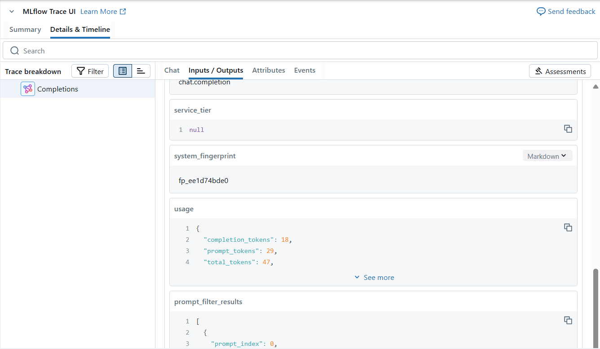

---
lab:
  title: Implement LLMOps with Azure Databricks
  description: You'll gain hands-on experience implementing LLMOps practices by using MLflow to track and log LLM interactions, including parameters, metrics, predictions, and artifacts for each model run. You'll learn how to use MLflow's autologging capabilities and the Trace UI to monitor model performance over time, compare traces across different runs, and detect data drift to ensure your LLM applications remain reliable and performant in production.
  duration: 30 minutes
  level: 400
  islab: true
  primarytopics:
    - Azure Databricks
    - Azure Portal
    - Microsoft Foundry
---

# Implement LLMOps with Azure Databricks

Azure Databricks provides a unified platform that streamlines the AI lifecycle, from data preparation to model serving and monitoring, optimizing the performance and efficiency of machine learning systems. It supports the development of generative AI applications, leveraging features like Unity Catalog for data governance, MLflow for model tracking, and Mosaic AI Model Serving for deploying LLMs.

This lab will take approximately **30** minutes to complete.

> **Note**: The Azure Databricks user interface is subject to continual improvement. The user interface may have changed since the instructions in this exercise were written.

## Before you start

You'll need an [Azure subscription](https://azure.microsoft.com/free) in which you have administrative-level access.

## Create a Microsoft Foundry resource and project

If you don't already have one, create a Microsoft Foundry resource and project in your Azure subscription.

> **Note**: Creating a Foundry resource only requires a subscription, resource group, region, and name. No Key Vault or Application Insights resources are needed.

1. Sign into the **Azure portal** at `https://portal.azure.com`.
2. Use the following link to open the Foundry resource creation page: `https://portal.azure.com/#create/Microsoft.CognitiveServicesAIFoundry`
3. On the **Create** page, provide the following information on the **Basics** tab:
    - **Subscription**: *Select your Azure subscription*
    - **Resource group**: *Choose or create a resource group*
    - **Region**: *Make a **random** choice from any of the following regions*\*
        - North Central US
        - Sweden Central
    - **Name**: *A unique name of your choice*
4. Select **Review + create**, then select **Create** and wait for deployment to complete.

> \* Foundry resources are constrained by regional quotas. The listed regions include default quota for the model type(s) used in this exercise. Randomly choosing a region reduces the risk of a single region reaching its quota limit in scenarios where you are sharing a subscription with other users. In the event of a quota limit being reached later in the exercise, there's a possibility you may need to create another resource in a different region.

5. Once deployment completes, go to the deployed resource. In the left pane, under **Resource Management**, select **Keys and Endpoint**, then copy the **Endpoint** — you will use it later in this exercise.

6. In the **Overview** page, select **Go to Microsoft Foundry** to open your resource in the Foundry portal (or navigate directly to `https://ai.azure.com`).

7. In **Microsoft Foundry**, create a new **project** within your Foundry resource:
    - Select the project name in the upper-left corner, then select **Create new project**.
    - Enter a **Project name** and select **Create project**.
    - Wait for the project to be created.

8. Launch Cloud Shell and run the following command to get a temporary authorization token for API calls. Keep it together with the endpoint copied previously.

    ```bash
    az account get-access-token --resource https://cognitiveservices.azure.com
    ```

    >**Note**: You only need to copy the `accessToken` field value and **not** the entire JSON output.

## Deploy the required model

Microsoft Foundry allows you to deploy, manage, and explore models.

> **Note**: As you use Microsoft Foundry, message boxes suggesting tasks for you to perform may be displayed. You can close these and follow the steps in this exercise.

1. In **Microsoft Foundry**, on the home page select **View deployments** (or select **Build** in the top navigation bar, then select **Deployments**).

1. Select **Deploy** > **Deploy a base model**, search for and select **gpt-4.1**, then select **Deploy** > **Custom settings** to configure the deployment with the following settings:
    - **Deployment name**: *gpt-4.1*
    - **Deployment type**: Standard
    - **Model version**: *2025-04-14*
    - **Model version upgrade policy**: Upgrade once new default version becomes available
    - **Enable dynamic quota**: Disabled
    - **Tokens per minute rate limit**: 10K\*
    - **Guardrails**: DefaultV2

> \* A rate limit of 10,000 tokens per minute is more than adequate to complete this exercise while leaving capacity for other people using the same subscription.

2. Wait for the deployment to complete.

## Provision an Azure Databricks workspace

> **Tip**: If you already have an Azure Databricks workspace, you can skip this procedure and use your existing workspace.

1. Sign into the **Azure portal** at `https://portal.azure.com`.
2. Create an **Azure Databricks** resource with the following settings:
    - **Subscription**: *Select the same Azure subscription that you used to create your Foundry resource*
    - **Resource group**: *The same resource group where you created your Foundry resource*
    - **Workspace name**: *A unique name of your choice*
    - **Region**: *Select any available region*
    - **Pricing tier**: Premium
    - **Workspace type**: Serverless

3. Select **Review + create** and wait for deployment to complete. Then go to the resource and launch the workspace.

## Create a notebook

1. In the Azure portal, browse to the resource group where the Azure Databricks workspace was created.

1. Select your Azure Databricks Service resource.

1. In the **Overview** page for your workspace, use the **Launch Workspace** button to open your Azure Databricks workspace in a new browser tab; signing in if prompted.

    > **Tip**: As you use the Databricks Workspace portal, various tips and notifications may be displayed. Dismiss these and follow the instructions provided to complete the tasks in this exercise.

1. In the sidebar, use the **(+) New** link to create a **Notebook**. Select **Serverless** as the default compute.

1. In the first code cell, enter and run the following code to install the required libraries:

    ```python
    %pip install openai mlflow
    dbutils.library.restartPython()
    ```
## Log the LLM using MLflow

MLflow’s LLM tracking capabilities allow you to log parameters, metrics, predictions, and artifacts. Parameters include key-value pairs detailing input configurations, while metrics provide quantitative measures of performance. Predictions encompass both the input prompts and the model’s responses, stored as artifacts for easy retrieval. This structured logging helps in maintaining a detailed record of each interaction, facilitating better analysis and optimization of LLMs.

1. In a new cell, run the following code with the access information you copied earlier to assign persistent environment variables for authentication:

     ```python
    import os

    os.environ["AZURE_OPENAI_ENDPOINT"] = "your_foundry_endpoint"
    os.environ["COGNITIVE_SERVICES_TOKEN"] = "your_cognitiveservices_access_token"  # from: az account get-access-token --resource https://cognitiveservices.azure.com
     ```

    > **Note**: The access token expires after approximately 60 minutes. If you encounter authentication errors during the lab, re-run the Cloud Shell command and update this cell.
1. In a new cell, run the following code to initialize your Azure OpenAI client:

     ```python
    import os
    from openai import AzureOpenAI

    client = AzureOpenAI(
       azure_endpoint = os.getenv("AZURE_OPENAI_ENDPOINT"),
       azure_ad_token = os.getenv("COGNITIVE_SERVICES_TOKEN"),
       api_version = "2024-08-01-preview"
    )
     ```

1. In a new cell, run the following code to initialize MLflow tracking and log the model:     

     ```python
    import mlflow
    from openai import AzureOpenAI

    system_prompt = "Assistant is a large language model trained by OpenAI."

    mlflow.openai.autolog()

    with mlflow.start_run():

        response = client.chat.completions.create(
            model="gpt-4.1",
            messages=[
                {"role": "system", "content": system_prompt},
                {"role": "user", "content": "Tell me a joke about animals."},
            ],
        )

        print(response.choices[0].message.content)
        mlflow.log_param("completion_tokens", response.usage.completion_tokens)
    mlflow.end_run()
     ```

The cell above will start an experiment in your workspace and register the traces of each chat completion iteration, keeping track of the inputs, outputs and metadata of each run.

## Monitor the model

After running the last cell, MLflow Trace UI will automatically be displayed together with the cell's output. You can also see it by selecting **Experiments** in the left sidebar, and then opening your notebook's experiment run:

     

The command `mlflow.openai.autolog()` will log the traces of each run by default, but you can also log additional parameters with `mlflow.log_param()` that can later be used to monitor the model. Once you start monitoring the model, you can compare the traces from different runs to detect data drift. Look for significant changes in the input data distributions, model predictions, or performance metrics over time. You can also use statistical tests or visualization tools to aid in this analysis.

## Clean up

When you're done with your Microsoft Foundry resource, remember to delete the deployment or the entire resource in the **Azure portal** at `https://portal.azure.com`.

If you've finished exploring Azure Databricks, you can delete the resources you've created to avoid unnecessary Azure costs and free up capacity in your subscription.
