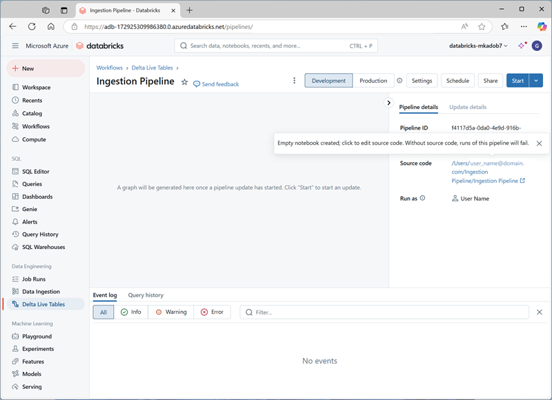

---
lab:
    title: 'End-to-End Streaming Pipeline with Delta Live Tables in Azure Databricks'
---

# End-to-End Streaming Pipeline with Delta Live Tables in Azure Databricks

Creating an end-to-end streaming pipeline with Delta Live Tables in Azure Databricks involves defining transformations on data, which Delta Live Tables then manage through task orchestration, cluster management, and monitoring. This framework supports streaming tables for handling data that is continuously updated, materialized views for complex transformations, and views for intermediate transformations and data quality checks.

This lab will take approximately **30** minutes to complete.

> **Note**: The Azure Databricks user interface is subject to continual improvement. The user interface may have changed since the instructions in this exercise were written.

## Provision an Azure Databricks workspace

> **Tip**: If you already have an Azure Databricks workspace, you can skip this procedure and use your existing workspace.

This exercise includes a script to provision a new Azure Databricks workspace. The script attempts to create a *Premium* tier Azure Databricks workspace resource in a region in which your Azure subscription has sufficient quota for the compute cores required in this exercise; and assumes your user account has sufficient permissions in the subscription to create an Azure Databricks workspace resource. If the script fails due to insufficient quota or permissions, you can try to [create an Azure Databricks workspace interactively in the Azure portal](https://learn.microsoft.com/azure/databricks/getting-started/#--create-an-azure-databricks-workspace).

1. In a web browser, sign into the [Azure portal](https://portal.azure.com) at `https://portal.azure.com`.
2. Use the **[\>_]** button to the right of the search bar at the top of the page to create a new Cloud Shell in the Azure portal, selecting a ***PowerShell*** environment. The cloud shell provides a command line interface in a pane at the bottom of the Azure portal, as shown here:

    

    > **Note**: If you have previously created a cloud shell that uses a *Bash* environment, switch it to ***PowerShell***.

3. Note that you can resize the cloud shell by dragging the separator bar at the top of the pane, or by using the **&#8212;**, **&#10530;**, and **X** icons at the top right of the pane to minimize, maximize, and close the pane. For more information about using the Azure Cloud Shell, see the [Azure Cloud Shell documentation](https://docs.microsoft.com/azure/cloud-shell/overview).

4. In the PowerShell pane, enter the following commands to clone this repo:

     ```powershell
    rm -r mslearn-databricks -f
    git clone https://github.com/MicrosoftLearning/mslearn-databricks
     ```

5. After the repo has been cloned, enter the following command to run the **setup.ps1** script, which provisions an Azure Databricks workspace in an available region:

     ```powershell
    ./mslearn-databricks/setup.ps1
     ```

6. If prompted, choose which subscription you want to use (this will only happen if you have access to multiple Azure subscriptions).

7. Wait for the script to complete - this typically takes around 5 minutes, but in some cases may take longer. While you are waiting, review the [Streaming and incremental ingestion](https://learn.microsoft.com/azure/databricks/ingestion/streaming) article in the Azure Databricks documentation.

## Create a cluster

Azure Databricks is a distributed processing platform that uses Apache Spark *clusters* to process data in parallel on multiple nodes. Each cluster consists of a driver node to coordinate the work, and worker nodes to perform processing tasks. In this exercise, you'll create a *single-node* cluster to minimize the compute resources used in the lab environment (in which resources may be constrained). In a production environment, you'd typically create a cluster with multiple worker nodes.

> **Tip**: If you already have a cluster with a 13.3 LTS or higher runtime version in your Azure Databricks workspace, you can use it to complete this exercise and skip this procedure.

1. In the Azure portal, browse to the **msl-*xxxxxxx*** resource group that was created by the script (or the resource group containing your existing Azure Databricks workspace)

1. Select your Azure Databricks Service resource (named **databricks-*xxxxxxx*** if you used the setup script to create it).

1. In the **Overview** page for your workspace, use the **Launch Workspace** button to open your Azure Databricks workspace in a new browser tab; signing in if prompted.

    > **Tip**: As you use the Databricks Workspace portal, various tips and notifications may be displayed. Dismiss these and follow the instructions provided to complete the tasks in this exercise.

1. In the sidebar on the left, select the **(+) New** task, and then select **Cluster** (you may need to look in the **More** submenu).

1. In the **New Cluster** page, create a new cluster with the following settings:
    - **Cluster name**: *User Name's* cluster (the default cluster name)
    - **Policy**: Unrestricted
    - **Cluster mode**: Single Node
    - **Access mode**: Single user (*with your user account selected*)
    - **Databricks runtime version**: 13.3 LTS (Spark 3.4.1, Scala 2.12) or later
    - **Use Photon Acceleration**: Selected
    - **Node type**: Standard_D4ds_v5
    - **Terminate after** *20* **minutes of inactivity**

1. Wait for the cluster to be created. It may take a minute or two.

    > **Note**: If your cluster fails to start, your subscription may have insufficient quota in the region where your Azure Databricks workspace is provisioned. See [CPU core limit prevents cluster creation](https://docs.microsoft.com/azure/databricks/kb/clusters/azure-core-limit) for details. If this happens, you can try deleting your workspace and creating a new one in a different region. You can specify a region as a parameter for the setup script like this: `./mslearn-databricks/setup.ps1 eastus`

## Create a notebook and ingest data

1. In the sidebar, use the **(+) New** link to create a **Notebook**. In the **Connect** drop-down list, select your cluster if it is not already selected. If the cluster is not running, it may take a minute or so to start.
2. Change the default notebook name (**Untitled Notebook *[date]***) to **Delta Live Tables Ingestion**.

3. In the first cell of the notebook, enter the following code, which uses *shell* commands to download data files from GitHub into the file system used by your cluster.

     ```python
    %sh
    rm -r /dbfs/device_stream
    mkdir /dbfs/device_stream
    !wget -O /dbfs/device_stream/device_data.csv https://github.com/MicrosoftLearning/mslearn-databricks/raw/main/data/device_data.csv
     ```

4. Use the **&#9656; Run Cell** menu option at the left of the cell to run it. Then wait for the Spark job run by the code to complete.

## Use delta tables for streaming data

Delta lake supports *streaming* data. Delta tables can be a *sink* or a *source* for data streams created using the Spark Structured Streaming API. In this example, you'll use a delta table as a sink for some streaming data in a simulated internet of things (IoT) scenario. In the next task, this delta table will work as a source for data transformation in real time.

1. In a new cell, run the following code to create a stream based on the folder containing the csv device data:

     ```python
    from pyspark.sql.functions import *
    from pyspark.sql.types import *

    # Define the schema for the incoming data
    schema = StructType([
        StructField("device_id", StringType(), True),
        StructField("timestamp", TimestampType(), True),
        StructField("temperature", DoubleType(), True),
        StructField("humidity", DoubleType(), True)
    ])

    # Read streaming data from folder
    inputPath = '/device_stream/'
    iotstream = spark.readStream.schema(schema).option("header", "true").csv(inputPath)
    print("Source stream created...")

    # Write the data to a Delta table
    query = (iotstream
             .writeStream
             .format("delta")
             .option("checkpointLocation", "/tmp/checkpoints/iot_data")
             .start("/tmp/delta/iot_data"))
     ```

2. Use the **&#9656; Run Cell** menu option at the left of the cell to run it.

This delta table will now become the source for data transformation in real time.

   > Note: The code cell above creates the source stream. Therefore, the job run will never change to a completed status. To manually stop streaming, you can run `query.stop()` in a new cell.
   
## Create a Delta Live Table Pipeline

A pipeline is the main unit for configuring and running data processing workflows with Delta Live Tables. It links data sources to target datasets through a Directed Acyclic Graph (DAG) declared in Python or SQL.

1. Select **Delta Live Tables** in the left sidebar and then select **Create Pipeline**.

2. In the **Create pipeline** page, create a new pipeline with the following settings:
    - **Pipeline name**: `Ingestion Pipeline`
    - **Product edition**: Advanced
    - **Pipeline mode**: Triggered
    - **Source code**: *Leave blank*
    - **Storage options**: Hive Metastore
    - **Storage location**: `dbfs:/pipelines/device_stream`
    - **Target schema**: `default`

3. Select **Create** to create the pipeline (which will also create a blank notebook for the pipeline code).

4. Once the pipeline is created, open the link to the blank notebook under **Source code** in the right-side panel. This opens the notebook in a new browser tab:

    

5. In the first cell of the blank notebook, enter (but don't run) the following code to create Delta Live Tables and transform the data:

     ```python
    import dlt
    from pyspark.sql.functions import col, current_timestamp
     
    @dlt.table(
        name="raw_iot_data",
        comment="Raw IoT device data"
    )
    def raw_iot_data():
        return spark.readStream.format("delta").load("/tmp/delta/iot_data")

    @dlt.table(
        name="transformed_iot_data",
        comment="Transformed IoT device data with derived metrics"
    )
    def transformed_iot_data():
        return (
            dlt.read("raw_iot_data")
            .withColumn("temperature_fahrenheit", col("temperature") * 9/5 + 32)
            .withColumn("humidity_percentage", col("humidity") * 100)
            .withColumn("event_time", current_timestamp())
        )
     ```

6. Close the browser tab containing the notebook (the contents are automatically saved) and return to the pipeline. Then select **Start**.

7. After the pipeline has successfully completed, go back to the recent **Delta Live Tables Ingestion** that you created first, and verify that the new tables have been created in the specified storage location by running the following code in a new cell:

     ```sql
    %sql
    SHOW TABLES
     ```

## View results as a visualization

After creating the tables, it is possible to load them into dataframes and visualize the data.

1. In the first notebook, add a new code cell and run the following code to load the `transformed_iot_data` into a dataframe:

    ```python
    %sql
    SELECT * FROM transformed_iot_data
    ```

1. Above the table of results, select **+** and then select **Visualization** to view the visualization editor, and then apply the following options:
    - **Visualization type**: Line
    - **X Column**: timestamp
    - **Y Column**: *Add a new column and select* **temperature_fahrenheit**. *Apply the* **Sum** *aggregation*.

1. Save the visualization and view the resulting chart in the notebook.
1. Add a new code cell and enter the following code to stop the streaming query:

    ```python
    query.stop()
    ```
    

## Clean up

In Azure Databricks portal, on the **Compute** page, select your cluster and select **&#9632; Terminate** to shut it down.

If you've finished exploring Azure Databricks, you can delete the resources you've created to avoid unnecessary Azure costs and free up capacity in your subscription.
