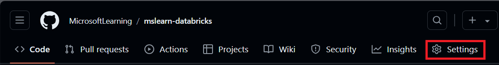

---
lab:
    title: 'Implement CI/CD workflows with Azure Databricks'
---

# Implement CI/CD workflows with Azure Databricks

Implementing CI/CD workflows with GitHub Actions and Azure Databricks can streamline your development process and enhance automation. GitHub Actions provide a powerful platform for automating software workflows, including continuous integration (CI) and continuous delivery (CD). When integrated with Azure Databricks, these workflows can execute complex data tasks, like running notebooks or deploying updates to Databricks environments. For instance, you can use GitHub Actions to automate the deployment of Databricks notebooks, manage Databricks file system uploads, and set up the Databricks CLI within your workflows. This integration facilitates a more efficient and error-resistant development cycle, especially for data-driven applications.

This lab will take approximately **30** minutes to complete.

> **Note**: The Azure Databricks user interface is subject to continual improvement. The user interface may have changed since the instructions in this exercise were written.

> **Note:** You need a GitHub account and a Git client (such as the Git command line tool) installed on your local computer to complete this exercise.

## Provision an Azure Databricks workspace

> **Tip**: If you already have an Azure Databricks workspace, you can skip this procedure and use your existing workspace.

This exercise includes a script to provision a new Azure Databricks workspace. The script attempts to create a *Premium* tier Azure Databricks workspace resource in a region in which your Azure subscription has sufficient quota for the compute cores required in this exercise; and assumes your user account has sufficient permissions in the subscription to create an Azure Databricks workspace resource. If the script fails due to insufficient quota or permissions, you can try to [create an Azure Databricks workspace interactively in the Azure portal](https://learn.microsoft.com/azure/databricks/getting-started/#--create-an-azure-databricks-workspace).

1. In a web browser, sign into the [Azure portal](https://portal.azure.com) at `https://portal.azure.com`.
2. Use the **[\>_]** button to the right of the search bar at the top of the page to create a new Cloud Shell in the Azure portal, selecting a ***PowerShell*** environment. The cloud shell provides a command line interface in a pane at the bottom of the Azure portal, as shown here:

    

    > **Note**: If you have previously created a cloud shell that uses a *Bash* environment, switch it to ***PowerShell***.

3. Note that you can resize the cloud shell by dragging the separator bar at the top of the pane, or by using the **&#8212;**, **&#10530;**, and **X** icons at the top right of the pane to minimize, maximize, and close the pane. For more information about using the Azure Cloud Shell, see the [Azure Cloud Shell documentation](https://docs.microsoft.com/azure/cloud-shell/overview).

4. In the PowerShell pane, enter the following commands to clone this repo:

     ```powershell
    rm -r mslearn-databricks -f
    git clone https://github.com/MicrosoftLearning/mslearn-databricks
     ```

5. After the repo has been cloned, enter the following command to run the **setup.ps1** script, which provisions an Azure Databricks workspace in an available region:

     ```powershell
    ./mslearn-databricks/setup.ps1
     ```

6. If prompted, choose which subscription you want to use (this will only happen if you have access to multiple Azure subscriptions).

7. Wait for the script to complete - this typically takes around 5 minutes, but in some cases may take longer. While you are waiting, review the [Run a CI/CD workflow with a Databricks Asset Bundle and GitHub Actions](https://learn.microsoft.com/azure/databricks/dev-tools/bundles/ci-cd-bundles) article in the Azure Databricks documentation.

## Create a cluster

Azure Databricks is a distributed processing platform that uses Apache Spark *clusters* to process data in parallel on multiple nodes. Each cluster consists of a driver node to coordinate the work, and worker nodes to perform processing tasks. In this exercise, you'll create a *single-node* cluster to minimize the compute resources used in the lab environment (in which resources may be constrained). In a production environment, you'd typically create a cluster with multiple worker nodes.

> **Tip**: If you already have a cluster with a 13.3 LTS or higher runtime version in your Azure Databricks workspace, you can use it to complete this exercise and skip this procedure.

1. In the Azure portal, browse to the **msl-*xxxxxxx*** resource group that was created by the script (or the resource group containing your existing Azure Databricks workspace)

1. Select your Azure Databricks Service resource (named **databricks-*xxxxxxx*** if you used the setup script to create it).

1. In the **Overview** page for your workspace, use the **Launch Workspace** button to open your Azure Databricks workspace in a new browser tab; signing in if prompted.

    > **Tip**: As you use the Databricks Workspace portal, various tips and notifications may be displayed. Dismiss these and follow the instructions provided to complete the tasks in this exercise.

1. In the sidebar on the left, select the **(+) New** task, and then select **Cluster** (you may need to look in the **More** submenu).

1. In the **New Cluster** page, create a new cluster with the following settings:
    - **Cluster name**: *User Name's* cluster (the default cluster name)
    - **Policy**: Unrestricted
    - **Cluster mode**: Single Node
    - **Access mode**: Single user (*with your user account selected*)
    - **Databricks runtime version**: 13.3 LTS (Spark 3.4.1, Scala 2.12) or later
    - **Use Photon Acceleration**: Selected
    - **Node type**: Standard_D4ds_v5
    - **Terminate after** *20* **minutes of inactivity**

1. Wait for the cluster to be created. It may take a minute or two.

    > **Note**: If your cluster fails to start, your subscription may have insufficient quota in the region where your Azure Databricks workspace is provisioned. See [CPU core limit prevents cluster creation](https://docs.microsoft.com/azure/databricks/kb/clusters/azure-core-limit) for details. If this happens, you can try deleting your workspace and creating a new one in a different region. You can specify a region as a parameter for the setup script like this: `./mslearn-databricks/setup.ps1 eastus`
   
## Set up a GitHub repository

Once you connect a GitHub repository to an Azure Databricks workspace, you can set up CI/CD pipelines in GitHub Actions that trigger with any changes made to your repository.

1. Go to your [GitHub account](https://github.com/) and create a new private repository with a suitable name (for example, *databricks-cicd-repo*).

1. Clone the empty repository to your local machine using the [git clone](https://git-scm.com/docs/git-clone) command.

1. Download the required files for this exercise to the local folder for your repository:
   - [CSV file](https://github.com/MicrosoftLearning/mslearn-databricks/raw/main/data/sample_sales.csv)
   - [Databricks notebook](https://github.com/MicrosoftLearning/mslearn-databricks/raw/main/data/sample_sales_notebook.py)
   - [Job configuration file](https://github.com/MicrosoftLearning/mslearn-databricks/raw/main/data/job-config.json)

1. In your local clone of the Git repo, [add](https://git-scm.com/docs/git-add) the files. Then [commit](https://git-scm.com/docs/git-commit) the changes and [push](https://git-scm.com/docs/git-push) them to the repo.

## Set up repository secrets

Secrets are variables that you create in an organization, repository, or repository environment. The secrets that you create are available to use in GitHub Actions workflows. GitHub Actions can only read a secret if you explicitly include the secret in a workflow.

As GitHub Actions workflows need to access resources from Azure Databricks, authentication credentials will be stored as encrypted variables to be used with the CI/CD pipelines.

Before creating repository secrets, you need to generate a personal access token in Azure Databricks:

1. In your Azure Databricks workspace, select the *user* icon in the top bar, and then select **Settings** from the drop down.

1. On the **Developer** page, next to **Access tokens**, select **Manage**.

1. Select **Generate new token** and then select **Generate**.

1. Copy the displayed token and paste it somewhere you can refer to it later. Then select **Done**.

1. Now in your GitHub repository page, select the **Settings** tab.

   

1. In the left sidebar, select **Secrets and variables** and then select **Actions**.

1. Select **New repository secret** and add each of these variables:
   - **Name:** DATABRICKS_HOST **Secret:** Add the URL of your Databricks workspace.
   - **Name:** DATABRICKS_TOKEN **Secret:** Add the access token generated previously.

## Set up CI pipeline

Now that you have stored the necessary credentials for accessing your Azure Databricks workspace from GitHub, you will create a workflow to automate data ingestion. It will deploy whenever the repository's main branch has a commit pushed or a pull request merged. This workflow will ensure that the data source used in the Azure Databricks workspace is always up to date.

1. In your repository page, select the **Actions** tab.

    

1. Select **set up a workflow yourself** and enter the following code:

     ```yaml
    name: CI Pipeline for Azure Databricks

    on:
      push:
        branches:
          - main
      pull_request:
        branches:
          - main

    jobs:
      deploy:
        runs-on: ubuntu-latest

        steps:
        - name: Checkout code
          uses: actions/checkout@v3

        - name: Set up Python
          uses: actions/setup-python@v4
          with:
            python-version: '3.x'

        - name: Install Databricks CLI
          run: |
            pip install databricks-cli

        - name: Configure Databricks CLI
          run: |
            databricks configure --token <<EOF
            ${{ secrets.DATABRICKS_HOST }}
            ${{ secrets.DATABRICKS_TOKEN }}
            EOF

        - name: Upload sample data to DBFS
          run: databricks fs cp sample_sales.csv dbfs:/FileStore/sample_sales.csv --overwrite
     ```

    The code above will install and configure Databricks CLI, and copy the sample data from your repository to your workspace.

1. Name the workflow **CI_pipeline.yml** and select **Commit changes**. The pipeline will run automatically and you can check its status in the **Actions** tab.

1. Once the workflow is completed, go to your workspace page, select **+ New** and create a new notebook.
  
1. In the first code cell, run the following code:

     ```python
    %fs
    ls FileStore
     ``` 

    In the output, you can verify that the sample data is now present in the Databricks file system and can now be used in the workspace.

## Set up CD pipeline

After setting up the CI workflow to automate data ingestion, you will create a second workflow to automate data processing. The CD workflow will execute a notebook as a job run with its output registered in the **Job runs** page of your Azure Databricks workspace. The notebook contains all the transformation steps required by the data before it is consumed.

1. Go to your workspace page, select **Compute** and then select your cluster.

1. In the cluster's page, open up the options to the left of the **Terminate** button, and then select **View JSON**. Copy the cluster's id as it will be needed to set up the job run in the workflow.

1. Open the **job-config.json** in your repository and replace *your_cluster_id* with the cluster id you just copied. Also replace */Workspace/Users/your_username/your_notebook* with the path in your workspace where you want to store the notebook used in the pipeline. Commit the changes.

    > **Note:** If you go to the **Actions** tab, you will see that the CI pipeline started running again. Since it is supposed to trigger whenever a commit is pushed, changing *job-config.json* will deploy the pipeline as expected.

1. In the **Actions** tab, create a new workflow named **CD_pipeline.yml** and enter the following code:

     ```yaml
    name: CD Pipeline for Azure Databricks

    on:
      push:
        branches:
          - main

    jobs:
      deploy:
        runs-on: ubuntu-latest

        steps:
        - name: Checkout code
          uses: actions/checkout@v3

        - name: Set up Python
          uses: actions/setup-python@v4
          with:
            python-version: '3.x'

        - name: Install Databricks CLI
          run: pip install databricks-cli

        - name: Configure Databricks CLI
          run: |
            databricks configure --token <<EOF
            ${{ secrets.DATABRICKS_HOST }}
            ${{ secrets.DATABRICKS_TOKEN }}
            EOF
     
        - name: Import Notebook to Workspace
          run: databricks workspace import sample_sales_notebook.py /Workspace/Users/your_username/your_notebook -l python --overwrite

          env:
            DATABRICKS_TOKEN: ${{ secrets.DATABRICKS_TOKEN }}

        - name: Run Databricks Job
          run: |
            databricks jobs create --json-file job-config.json
            databricks jobs run-now --job-id $(databricks jobs list | grep -m 1 'CD pipeline' | awk '{print $1}')
          env:
            DATABRICKS_TOKEN: ${{ secrets.DATABRICKS_TOKEN }}
     ```

    Before committing the changes, replace `/Workspace/Users/your_username/your_notebook` with the file path where you want to import the notebook in your Azure Databricks workspace.

1. Commit the changes.

    This code will once again install and configure Databricks CLI, import the notebook to your workspace, and create a job run that will execute it. You can monitor the progress of the job run in the **Workflows** page of your workspace. Check the output and verify that the data sample is loaded into a dataframe and modified for further analysis.

## Clean up

In Azure Databricks portal, on the **Compute** page, select your cluster and select **&#9632; Terminate** to shut it down.

If you've finished exploring Azure Databricks, you can delete the resources you've created to avoid unnecessary Azure costs and free up capacity in your subscription.
