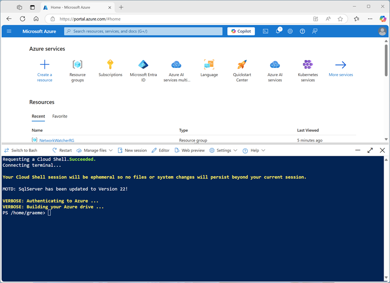

---
lab:
    title: 'Get started with machine learning in Azure Databricks'
---

# Get started with machine learning in Azure Databricks

In this exercise, you'll explore techniques for preparing data and training machine learning models in Azure Databricks.

This exercise should take approximately **45** minutes to complete.

> **Note**: The Azure Databricks user interface is subject to continual improvement. The user interface may have changed since the instructions in this exercise were written.

## Before you start

You'll need an [Azure subscription](https://azure.microsoft.com/free) in which you have administrative-level access.

## Provision an Azure Databricks workspace

> **Tip**: If you already have an Azure Databricks workspace, you can skip this procedure and use your existing workspace.

This exercise includes a script to provision a new Azure Databricks workspace. The script attempts to create a *Premium* tier Azure Databricks workspace resource in a region in which your Azure subscription has sufficient quota for the compute cores required in this exercise; and assumes your user account has sufficient permissions in the subscription to create an Azure Databricks workspace resource. If the script fails due to insufficient quota or permissions, you can try to [create an Azure Databricks workspace interactively in the Azure portal](https://learn.microsoft.com/azure/databricks/getting-started/#--create-an-azure-databricks-workspace).

1. In a web browser, sign into the [Azure portal](https://portal.azure.com) at `https://portal.azure.com`.
2. Use the **[\>_]** button to the right of the search bar at the top of the page to create a new Cloud Shell in the Azure portal, selecting a ***PowerShell*** environment. The cloud shell provides a command line interface in a pane at the bottom of the Azure portal, as shown here:

    

    > **Note**: If you have previously created a cloud shell that uses a *Bash* environment, switch it to ***PowerShell***.

3. Note that you can resize the cloud shell by dragging the separator bar at the top of the pane, or by using the **&#8212;**, **&#10530;**, and **X** icons at the top right of the pane to minimize, maximize, and close the pane. For more information about using the Azure Cloud Shell, see the [Azure Cloud Shell documentation](https://docs.microsoft.com/azure/cloud-shell/overview).

4. In the PowerShell pane, enter the following commands to clone this repo:

    ```
    rm -r mslearn-databricks -f
    git clone https://github.com/MicrosoftLearning/mslearn-databricks
    ```

5. After the repo has been cloned, enter the following command to run the **setup.ps1** script, which provisions an Azure Databricks workspace in an available region:

    ```
    ./mslearn-databricks/setup.ps1
    ```

6. If prompted, choose which subscription you want to use (this will only happen if you have access to multiple Azure subscriptions).
7. Wait for the script to complete - this typically takes around 5 minutes, but in some cases may take longer. While you are waiting, review the [What is Databricks Machine Learning?](https://learn.microsoft.com/azure/databricks/machine-learning/) article in the Azure Databricks documentation.

## Create a cluster

Azure Databricks is a distributed processing platform that uses Apache Spark *clusters* to process data in parallel on multiple nodes. Each cluster consists of a driver node to coordinate the work, and worker nodes to perform processing tasks. In this exercise, you'll create a *single-node* cluster to minimize the compute resources used in the lab environment (in which resources may be constrained). In a production environment, you'd typically create a cluster with multiple worker nodes.

> **Tip**: If you already have a cluster with a 13.3 LTS **<u>ML</u>** or higher runtime version in your Azure Databricks workspace, you can use it to complete this exercise and skip this procedure.

1. In the Azure portal, browse to the **msl-*xxxxxxx*** resource group that was created by the script (or the resource group containing your existing Azure Databricks workspace)
1. Select your Azure Databricks Service resource (named **databricks-*xxxxxxx*** if you used the setup script to create it).
1. In the **Overview** page for your workspace, use the **Launch Workspace** button to open your Azure Databricks workspace in a new browser tab; signing in if prompted.

    > **Tip**: As you use the Databricks Workspace portal, various tips and notifications may be displayed. Dismiss these and follow the instructions provided to complete the tasks in this exercise.

1. In the sidebar on the left, select the **(+) New** task, and then select **Cluster**.
1. In the **New Cluster** page, create a new cluster with the following settings:
    - **Cluster name**: *User Name's* cluster (the default cluster name)
    - **Policy**: Unrestricted
    - **Cluster mode**: Single Node
    - **Access mode**: Single user (*with your user account selected*)
    - **Databricks runtime version**: *Select the **<u>ML</u>** edition of the latest non-beta version of the runtime (**Not** a Standard runtime version) that:*
        - *Does **not** use a GPU*
        - *Includes Scala > **2.11***
        - *Includes Spark > **3.4***
    - **Use Photon Acceleration**: <u>Un</u>selected
    - **Node type**: Standard_D4ds_v5
    - **Terminate after** *20* **minutes of inactivity**

1. Wait for the cluster to be created. It may take a minute or two.

> **Note**: If your cluster fails to start, your subscription may have insufficient quota in the region where your Azure Databricks workspace is provisioned. See [CPU core limit prevents cluster creation](https://docs.microsoft.com/azure/databricks/kb/clusters/azure-core-limit) for details. If this happens, you can try deleting your workspace and creating a new one in a different region. You can specify a region as a parameter for the setup script like this: `./mslearn-databricks/setup.ps1 eastus`

## Create a notebook

You're going to run code that uses the Spark MLLib library to train a machine learning model, so the first step is to create a new notebook in your workspace.

1. In the sidebar, use the **(+) New** link to create a **Notebook**.
1. Change the default notebook name (**Untitled Notebook *[date]***) to **Machine Learning** and in the **Connect** drop-down list, select your cluster if it is not already selected. If the cluster is not running, it may take a minute or so to start.

## Ingest data

The scenario for this exercise is based on observations of penguins in Antarctica, with the goal of training a machine learning model to predict the species of an observed penguin based on its location and body measurements.

> **Citation**: The penguins dataset used in the this exercise is a subset of data collected and made available by [Dr. Kristen
Gorman](https://www.uaf.edu/cfos/people/faculty/detail/kristen-gorman.php)
and the [Palmer Station, Antarctica LTER](https://pal.lternet.edu/), a
member of the [Long Term Ecological Research
Network](https://lternet.edu/).

1. In the first cell of the notebook, enter the following code, which uses *shell* commands to download the penguin data from GitHub into the file system used by your cluster.

    ```bash
    %sh
    rm -r /dbfs/ml_lab
    mkdir /dbfs/ml_lab
    wget -O /dbfs/ml_lab/penguins.csv https://raw.githubusercontent.com/MicrosoftLearning/mslearn-databricks/main/data/penguins.csv
    ```

1. Use the **&#9656; Run Cell** menu option at the left of the cell to run it. Then wait for the Spark job run by the code to complete.

## Explore and clean up the data
  
Now that you've ingested the data file, you can load it into a dataframe and view it.

1. Under the existing code cell, use the **+** icon to add a new code cell. Then in the new cell, enter and run the following code to load the data from the files and display it.

    ```python
   df = spark.read.format("csv").option("header", "true").load("/ml_lab/penguins.csv")
   display(df)
    ```

    The code initiates the necessary *Spark Jobs* to load the data, and the output is a *pyspark.sql.dataframe.DataFrame* object named *df*. You'll see this information displayed directly under the code, and you can use the **&#9656;** toggle to expand the **df: pyspark.sql.dataframe.DataFrame** output and see details of the columns it contains and their data types. Since this data was loaded from a text file and contained some blank values, Spark has assigned a **string** data type to all of the columns.
    
    The data itself consists of measurements of the following details of penguins that have been observed in Antarctica:
    
    - **Island**: The island in Antarctica where the penguin was observed.
    - **CulmenLength**: The length in mm of the penguin's culmen (bill).
    - **CulmenDepth**: The depth in mm of the penguin's culmen.
    - **FlipperLength**: The length in mm of the penguin's flipper.
    - **BodyMass**: The body mass of the penguin in grams.
    - **Species**: An integer value that represents the species of the penguin:
      - **0**: *Adelie*
      - **1**: *Gentoo*
      - **2**: *Chinstrap*
      
    Our goal in this project is to use the observed characteristics of a penguin (its *features*) in order to predict its species (which in machine learning terminology, we call the *label*).
      
    Note that some observations contain *null* or "missing" data values for some features. It's not uncommon for the raw source data you ingest to have issues like this, so typically the first stage in a machine learning project is to explore the data thoroughly and clean it up to make it more suitable for training a machine learning model.
    
1. Add a cell and use it to run the following cell to remove the rows with incomplete data by using the **dropna** method, and to apply appropriate data types to the data by using the **select** method with the **col** and **astype** functions.

    ```python
   from pyspark.sql.types import *
   from pyspark.sql.functions import *
   
   data = df.dropna().select(col("Island").astype("string"),
                              col("CulmenLength").astype("float"),
                             col("CulmenDepth").astype("float"),
                             col("FlipperLength").astype("float"),
                             col("BodyMass").astype("float"),
                             col("Species").astype("int")
                             )
   display(data)
    ```
    
    Once again, you can toggle the details of the dataframe that is returned (this time named *data*) to verify that the data types have been applied, and you can review the data to verify that the rows containing incomplete data have been removed.
    
    In a real project, you'd likely need to perform more exploration and data cleansing to fix (or remove) errors in the data, identify and remove outliers (untypically large or small values), or to balance the data so there's a reasonably equal number of rows for each label you're trying to predict.

    > **Tip**: You can learn more about methods and functions you can use with dataframes in the [Spark SQL reference](https://spark.apache.org/docs/latest/sql-programming-guide.html).

## Split the data

For the purposes of this exercise, we'll assume that the data is now suitable cleaned and ready for us to use to train a machine learning model. The label we're going to try to predict is a specific category or *class* (the species of a penguin), so the type of machine learning model we need to train is a *classification* model. Classification (along with *regression*, which is used to predict a numeric value) is a form or *supervised* machine learning in which we use training data that includes known values for the label we want to predict. The process of training a model is really just fitting an algorithm to the data in order to calculate how the feature values correlate to the known label value. We can then apply the trained model to a new observation for which we know the only the feature values and have it predict the label value.

To ensure we can have confidence in our trained model, the typical approach is to train the model with only *some* of the data, and hold back some data with known label values that we can use to test the trained model and see how accurately its predictions are. To accomplish this goal, we'll split the full data set into two randomized subsets. We'll use 70% of the data for training, and hold back 30% for testing.

1. Add and run a code cell with the following code to split the data.

    ```python
   splits = data.randomSplit([0.7, 0.3])
   train = splits[0]
   test = splits[1]
   print ("Training Rows:", train.count(), " Testing Rows:", test.count())
    ```

## Perform feature engineering

Having cleansed the raw data, a data scientists typically perform some additional work to prepare it for model training. This process is commonly known as *feature engineering*, and involves iteratively optimizing the features in the training dataset to produce the best possible model. The specific feature modifications required depends on the data and the desired model, but there are some common feature engineering tasks you should become familiar with.

### Encode categorical features

Machine learning algorithms are usually based on finding mathematical relationships between features and labels. That means that its usually best to define the features in your training data as *numeric* values. In some cases, you may have some features that are *categorical* rather than numeric, and which are expressed as strings - for example, the name of the island where the penguin observation occurred in our dataset. However, most algorithms expect numeric features; so these string-based categorical values need to be *encoded* as numbers. In this case, we'll use a **StringIndexer** from the **Spark MLLib** library to encode the island name as a numeric value by assigning a unique integer index for each discrete island name.

1. Run the following code to encode the **Island** categorical column values as numeric indexes.

    ```python
   from pyspark.ml.feature import StringIndexer

   indexer = StringIndexer(inputCol="Island", outputCol="IslandIdx")
   indexedData = indexer.fit(train).transform(train).drop("Island")
   display(indexedData)
    ```

    In the results, you should see that instead of an island name, each row now has an **IslandIdx** column with an integer value representing the island on which the observation was recorded.

### Normalize (scale) numeric features

Now let's turn our attention to the numeric values in our data. These values (**CulmenLength**, **CulmenDepth**, **FlipperLength**, and **BodyMass**) all represent measurements of one sort or another, but they're in different scales. When training a model, the units of measurement aren't as important as the relative differences across different observations, and features that are represented by larger numbers can often dominate the model training algorithm - skewing the importance of the feature when calculating a prediction. To mitigate this, it's common to *normalize* the numeric feature values so they're all on the same relative scale (for example, a decimal value between 0.0 and 1.0).

The code we'll use to do this is a little more involved than the categorical encoding we did previously. We need to scale multiple column values at the same time, so the technique we use is to create a single column containing a *vector* (essentially an array) of all the numeric features, and then apply a scaler to produce a new vector column with the equivalent normalized values.

1. Use the following code to normalize the numeric features and see a comparison of the pre-normalized and normalized vector columns.

    ```python
   from pyspark.ml.feature import VectorAssembler, MinMaxScaler

   # Create a vector column containing all numeric features
   numericFeatures = ["CulmenLength", "CulmenDepth", "FlipperLength", "BodyMass"]
   numericColVector = VectorAssembler(inputCols=numericFeatures, outputCol="numericFeatures")
   vectorizedData = numericColVector.transform(indexedData)
   
   # Use a MinMax scaler to normalize the numeric values in the vector
   minMax = MinMaxScaler(inputCol = numericColVector.getOutputCol(), outputCol="normalizedFeatures")
   scaledData = minMax.fit(vectorizedData).transform(vectorizedData)
   
   # Display the data with numeric feature vectors (before and after scaling)
   compareNumerics = scaledData.select("numericFeatures", "normalizedFeatures")
   display(compareNumerics)
    ```

    The **numericFeatures** column in the results contains a vector for each row. The vector includes four unscaled numeric values (the original measurements of the penguin). You can use the **&#9656;** toggle to see the discrete values more clearly.
    
    The **normalizedFeatures** column also contains a vector for each penguin observation, but this time the values in the vector are normalized to a relative scale based on the minimum and maximum values for each measurement.

### Prepare features and labels for training

Now, let's bring everything together and create a single column containing all of the features (the encoded categorical island name and the normalized penguin measurements), and another column containing the class label we want to train a model to predict (the penguin species).

1. Run the following code:

    ```python
   featVect = VectorAssembler(inputCols=["IslandIdx", "normalizedFeatures"], outputCol="featuresVector")
   preppedData = featVect.transform(scaledData)[col("featuresVector").alias("features"), col("Species").alias("label")]
   display(preppedData)
    ```

    The **features** vector contains five values (the encoded island and the normalized culmen length, culmen depth, flipper length, and body mass). The label contains a simple integer code that indicates the class of penguin species.

## Train a machine learning model

Now that the training data is prepared, you can use it to train a model. Models are trained using an *algorithm* that tries to establish a relationship between the features and labels. Since in this case you want to train a model that predicts a category of *class* , you need to use a *classification* algorithm. There are many algorithms for classification - let's start with a well-establish one: logistic regression, which iteratively attempts to find the optimal coefficients that can be applied to the features data in a logistic calculation that predicts the probability for each class label value. To train the model, you will fit the logistic regression algorithm to the training data.

1. Run the following code to train a model.

    ```python
   from pyspark.ml.classification import LogisticRegression

   lr = LogisticRegression(labelCol="label", featuresCol="features", maxIter=10, regParam=0.3)
   model = lr.fit(preppedData)
   print ("Model trained!")
    ```

    Most algorithms support parameters that give you some control over the way the model is trained. In this case, the logistic regression algorithm require you to identify the column containing the features vector and the column containing the known label; and also enables you to specify the maximum number of iterations performed to find optimal coeficients for the logistic calculation, and a regularization parameter that is used to prevent the model from *overfitting* (in other words, establishing a logistic calculation that works well with the training data, but which doesn't generalize well when applied to new data).

## Test the model

Now that you have a trained model, you can test it with the data you held back. Before you can do this, you need to perform the same feature engineering transformations to the test data as you applied to the training data (in this case, encode the island name and normalize the measurements). Then, you can use the model to predict labels for the features in the test data and compare the predicted labels to the actual known labels.

1. Use the following code to prepare the test data and then generate predictions:

    ```python
   # Prepare the test data
   indexedTestData = indexer.fit(test).transform(test).drop("Island")
   vectorizedTestData = numericColVector.transform(indexedTestData)
   scaledTestData = minMax.fit(vectorizedTestData).transform(vectorizedTestData)
   preppedTestData = featVect.transform(scaledTestData)[col("featuresVector").alias("features"), col("Species").alias("label")]
   
   # Get predictions
   prediction = model.transform(preppedTestData)
   predicted = prediction.select("features", "probability", col("prediction").astype("Int"), col("label").alias("trueLabel"))
   display(predicted)
    ```

    The results include the following columns:
    
    - **features**: The prepared features data from the test dataset.
    - **probability**: The probability calculated by the model for each class. This consists of a vector containing three probability values (because there are three classes) which add up to a total of 1.0 (its assumed that there's a 100% probability that the penguin belongs to *one* of the three species classes).
    - **prediction**: The predicted class label (the one with the highest probability).
    - **trueLabel**: The actual known label value from the test data.
    
    To evaluate the effectiveness of the model, you could simply compare the predicted and true labels in these results. However, you can get more meaningful metrics by using a model evaluator - in this case, a multiclass (because there are multiple possible class labels) classification evaluator.

1. Use the following code to get evaluation metrics for a classification model based on the results from the test data:

    ```python
   from pyspark.ml.evaluation import MulticlassClassificationEvaluator
   
   evaluator = MulticlassClassificationEvaluator(labelCol="label", predictionCol="prediction")
   
   # Simple accuracy
   accuracy = evaluator.evaluate(prediction, {evaluator.metricName:"accuracy"})
   print("Accuracy:", accuracy)
   
   # Individual class metrics
   labels = [0,1,2]
   print("\nIndividual class metrics:")
   for label in sorted(labels):
       print ("Class %s" % (label))
   
       # Precision
       precision = evaluator.evaluate(prediction, {evaluator.metricLabel:label,
                                                   evaluator.metricName:"precisionByLabel"})
       print("\tPrecision:", precision)
   
       # Recall
       recall = evaluator.evaluate(prediction, {evaluator.metricLabel:label,
                                                evaluator.metricName:"recallByLabel"})
       print("\tRecall:", recall)
   
       # F1 score
       f1 = evaluator.evaluate(prediction, {evaluator.metricLabel:label,
                                            evaluator.metricName:"fMeasureByLabel"})
       print("\tF1 Score:", f1)
   
   # Weighted (overall) metrics
   overallPrecision = evaluator.evaluate(prediction, {evaluator.metricName:"weightedPrecision"})
   print("Overall Precision:", overallPrecision)
   overallRecall = evaluator.evaluate(prediction, {evaluator.metricName:"weightedRecall"})
   print("Overall Recall:", overallRecall)
   overallF1 = evaluator.evaluate(prediction, {evaluator.metricName:"weightedFMeasure"})
   print("Overall F1 Score:", overallF1)
    ```

    The evaluation metrics that are calculated for multiclass classification include:
    
    - **Accuracy**: The proportion of overall predictions that were correct.
    - Per-class metrics:
      - **Precision**: The proportion of predictions of this class that were correct.
      - **Recall**: The proportion of actual instances of this class that were correctly predicted.
      - **F1 score**: A combined metric for precision and recall
    - Combined (weighted) precision, recall, and F1 metrics for all classes.
    
    > **Note**: It may initially seem like the overall accuracy metric provides the best way to evaluate a model's predictive performance. However, consider this. Suppose Gentoo penguins make up 95% of the penguin population in your study location. A model that always predicts the label **1** (the class for Gentoo) will have an accuracy of 0.95. That doesn't mean it's a great model for predicting a penguin species based on the features! That's why data scientists tend to explore additional metrics to get a better understanding of how well a classification model predicts for each possible class label.

## Use a pipeline

You trained your model by performing the required feature engineering steps and then fitting an algorithm to the data. To use the model with some test data to generate predictions (referred to as *inferencing*), you had to apply the same feature engineering steps to the test data. A more efficient way to build and use models is to encapsulate the transformers used to prepare the data and the model used to train it in a *pipeline*.

1. Use the following code to create a pipeline that encapsulates the data preparation and model training steps:

    ```python
   from pyspark.ml import Pipeline
   from pyspark.ml.feature import StringIndexer, VectorAssembler, MinMaxScaler
   from pyspark.ml.classification import LogisticRegression
   
   catFeature = "Island"
   numFeatures = ["CulmenLength", "CulmenDepth", "FlipperLength", "BodyMass"]
   
   # Define the feature engineering and model training algorithm steps
   catIndexer = StringIndexer(inputCol=catFeature, outputCol=catFeature + "Idx")
   numVector = VectorAssembler(inputCols=numFeatures, outputCol="numericFeatures")
   numScaler = MinMaxScaler(inputCol = numVector.getOutputCol(), outputCol="normalizedFeatures")
   featureVector = VectorAssembler(inputCols=["IslandIdx", "normalizedFeatures"], outputCol="Features")
   algo = LogisticRegression(labelCol="Species", featuresCol="Features", maxIter=10, regParam=0.3)
   
   # Chain the steps as stages in a pipeline
   pipeline = Pipeline(stages=[catIndexer, numVector, numScaler, featureVector, algo])
   
   # Use the pipeline to prepare data and fit the model algorithm
   model = pipeline.fit(train)
   print ("Model trained!")
    ```

    Since the feature engineering steps are now encapsulated in the model trained by the pipeline, you can use the model with the test data without needing to apply each transformation (they'll be applied automatically by the model).

1. Use the following code to apply the pipeline to the test data:

    ```python
   prediction = model.transform(test)
   predicted = prediction.select("Features", "probability", col("prediction").astype("Int"), col("Species").alias("trueLabel"))
   display(predicted)
    ```

## Try a different algorithm

So far you've trained a classification model by using the logistic regression algorithm. Let's change that stage in the pipeline to try a different algorithm.

1. Run the following code to create a pipeline that uses a Decision tree algorithm:

    ```python
   from pyspark.ml import Pipeline
   from pyspark.ml.feature import StringIndexer, VectorAssembler, MinMaxScaler
   from pyspark.ml.classification import DecisionTreeClassifier
   
   catFeature = "Island"
   numFeatures = ["CulmenLength", "CulmenDepth", "FlipperLength", "BodyMass"]
   
   # Define the feature engineering and model steps
   catIndexer = StringIndexer(inputCol=catFeature, outputCol=catFeature + "Idx")
   numVector = VectorAssembler(inputCols=numFeatures, outputCol="numericFeatures")
   numScaler = MinMaxScaler(inputCol = numVector.getOutputCol(), outputCol="normalizedFeatures")
   featureVector = VectorAssembler(inputCols=["IslandIdx", "normalizedFeatures"], outputCol="Features")
   algo = DecisionTreeClassifier(labelCol="Species", featuresCol="Features", maxDepth=10)
   
   # Chain the steps as stages in a pipeline
   pipeline = Pipeline(stages=[catIndexer, numVector, numScaler, featureVector, algo])
   
   # Use the pipeline to prepare data and fit the model algorithm
   model = pipeline.fit(train)
   print ("Model trained!")
    ```

    This time, the pipeline includes the same feature preparation stages as before but uses a *Decision Tree* algorithm to train the model.
    
1. Run the following code to use the new pipeline with the test data:

    ```python
   # Get predictions
   prediction = model.transform(test)
   predicted = prediction.select("Features", "probability", col("prediction").astype("Int"), col("Species").alias("trueLabel"))
   
   # Generate evaluation metrics
   from pyspark.ml.evaluation import MulticlassClassificationEvaluator
   
   evaluator = MulticlassClassificationEvaluator(labelCol="Species", predictionCol="prediction")
   
   # Simple accuracy
   accuracy = evaluator.evaluate(prediction, {evaluator.metricName:"accuracy"})
   print("Accuracy:", accuracy)
   
   # Class metrics
   labels = [0,1,2]
   print("\nIndividual class metrics:")
   for label in sorted(labels):
       print ("Class %s" % (label))
   
       # Precision
       precision = evaluator.evaluate(prediction, {evaluator.metricLabel:label,
                                                       evaluator.metricName:"precisionByLabel"})
       print("\tPrecision:", precision)
   
       # Recall
       recall = evaluator.evaluate(prediction, {evaluator.metricLabel:label,
                                                evaluator.metricName:"recallByLabel"})
       print("\tRecall:", recall)
   
       # F1 score
       f1 = evaluator.evaluate(prediction, {evaluator.metricLabel:label,
                                            evaluator.metricName:"fMeasureByLabel"})
       print("\tF1 Score:", f1)
   
   # Weighed (overall) metrics
   overallPrecision = evaluator.evaluate(prediction, {evaluator.metricName:"weightedPrecision"})
   print("Overall Precision:", overallPrecision)
   overallRecall = evaluator.evaluate(prediction, {evaluator.metricName:"weightedRecall"})
   print("Overall Recall:", overallRecall)
   overallF1 = evaluator.evaluate(prediction, {evaluator.metricName:"weightedFMeasure"})
   print("Overall F1 Score:", overallF1)
    ```

## Save the model

In reality, you'd iteratively try training the model with different algorithms (and parameters) to find the best model for your data. For now, we'll stick with the decision trees model we've trained. Let's save it so we can use it later with some new penguin observations.

1. Use the following code to save the model:

    ```python
   model.save("/models/penguin.model")
    ```

    Now, when you've been out and spotted a new penguin, you can load the saved model and use it to predict the penguin's species based on your measurements of its features. Using a model to generate predictions from new data is called *inferencing*.

1. Run the following code to load the model and use it to predict the species for a new penguin observation:

    ```python
   from pyspark.ml.pipeline import PipelineModel

   persistedModel = PipelineModel.load("/models/penguin.model")
   
   newData = spark.createDataFrame ([{"Island": "Biscoe",
                                     "CulmenLength": 47.6,
                                     "CulmenDepth": 14.5,
                                     "FlipperLength": 215,
                                     "BodyMass": 5400}])
   
   
   predictions = persistedModel.transform(newData)
   display(predictions.select("Island", "CulmenDepth", "CulmenLength", "FlipperLength", "BodyMass", col("prediction").alias("PredictedSpecies")))
    ```

## Clean up

In Azure Databricks portal, on the **Compute** page, select your cluster and select **&#9632; Terminate** to shut it down.

If you've finished exploring Azure Databricks, you can delete the resources you've created to avoid unnecessary Azure costs and free up capacity in your subscription.

> **More information**: For more information see the [Spark MLLib documentation](https://spark.apache.org/docs/latest/ml-guide.html).
