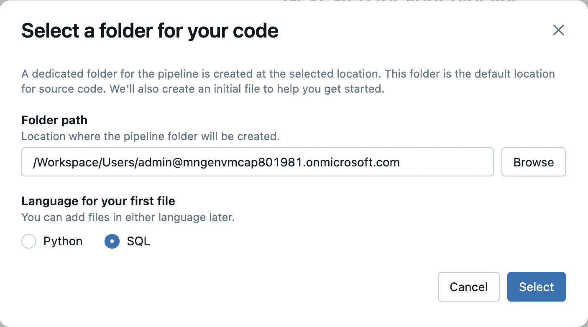
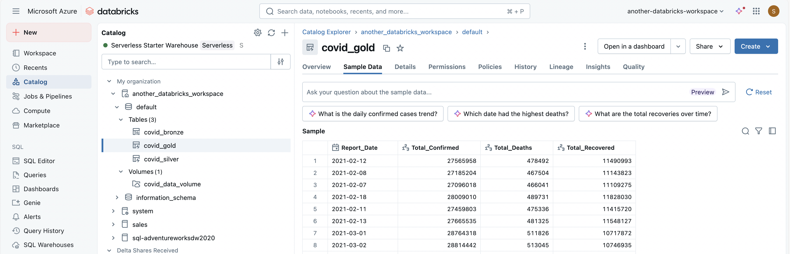

---
lab:
    title: 'Create a Lakeflow Spark Declarative Pipelines'
---

# Create a Lakeflow Spark Declarative Pipeline

Lakeflow Spark Declarative Pipelines is a framework within the Databricks Lakehouse Platform for building and running data pipelines in a **declarative** manner. This means you specify what data transformations you want to achieve, and the system automatically figures out how to execute them efficiently, handling many of the complexities of traditional data engineering.

Lakeflow Spark Declarative Pipelines simplifies the development of ETL (Extract, Transform, Load) pipelines by abstracting away the complex, low-level details. Instead of writing procedural code that dictates every step, you use a simpler, declarative syntax in SQL or Python.

This lab will take approximately **40** minutes to complete.

> **Note**: The Azure Databricks user interface is subject to continual improvement. The user interface may have changed since the instructions in this exercise were written. Lakeflow Spark Declarative Pipelines is the evolution of Databricks' Delta Live Tables (DLT), offering a unified approach for both batch and streaming workloads.

## Provision an Azure Databricks workspace

> **Tip**: If you already have an Azure Databricks workspace, you can skip this procedure and use your existing workspace.

This exercise includes a script to provision a new Azure Databricks workspace. The script attempts to create a *Premium* tier Azure Databricks workspace resource in a region in which your Azure subscription has sufficient quota for the compute cores required in this exercise; and assumes your user account has sufficient permissions in the subscription to create an Azure Databricks workspace resource. If the script fails due to insufficient quota or permissions, you can try to [create an Azure Databricks workspace interactively in the Azure portal](https://learn.microsoft.com/azure/databricks/getting-started/#--create-an-azure-databricks-workspace).

1. In a web browser, sign into the [Azure portal](https://portal.azure.com) at `https://portal.azure.com`.
2. Use the **[\>_]** button to the right of the search bar at the top of the page to create a new Cloud Shell in the Azure portal, selecting a ***PowerShell*** environment. The cloud shell provides a command line interface in a pane at the bottom of the Azure portal, as shown here:

    

    > **Note**: If you have previously created a cloud shell that uses a *Bash* environment, switch it to ***PowerShell***.

3. Note that you can resize the cloud shell by dragging the separator bar at the top of the pane, or by using the **&#8212;**, **&#10530;**, and **X** icons at the top right of the pane to minimize, maximize, and close the pane. For more information about using the Azure Cloud Shell, see the [Azure Cloud Shell documentation](https://docs.microsoft.com/azure/cloud-shell/overview).

4. In the PowerShell pane, enter the following commands to clone this repo:

     ```powershell
    rm -r mslearn-databricks -f
    git clone https://github.com/MicrosoftLearning/mslearn-databricks
     ```

5. After the repo has been cloned, enter the following command to run the **setup.ps1** script, which provisions an Azure Databricks workspace in an available region:

     ```powershell
    ./mslearn-databricks/setup.ps1
     ```

6. If prompted, choose which subscription you want to use (this will only happen if you have access to multiple Azure subscriptions).

7. Wait for the script to complete - this typically takes around 5 minutes, but in some cases may take longer. While you are waiting, review the [Lakeflow Spark Declarative Pipelines](https://learn.microsoft.com/azure/databricks/dlt/) article in the Azure Databricks documentation.

## Open the Azure Databricks Workspace

1. In the Azure portal, browse to the **msl-*xxxxxxx*** resource group that was created by the script (or the resource group containing your existing Azure Databricks workspace)

2. Select your Azure Databricks Service resource (named **databricks-*xxxxxxx*** if you used the setup script to create it).

3. In the **Overview** page for your workspace, use the **Launch Workspace** button to open your Azure Databricks workspace in a new browser tab; signing in if prompted.

    > **Tip**: As you use the Databricks Workspace portal, various tips and notifications may be displayed. Dismiss these and follow the instructions provided to complete the tasks in this exercise.

## Create a notebook and ingest data

1. In the sidebar, use the **(+) New** link to create a **Notebook**.

2. Change the default notebook name (**Untitled Notebook *[date]***) to `Data Ingestion and Exploration` and in the **Connect** drop-down list, select the **Serverless cluster** if it is not already selected. If the cluster is not running, it may take a minute or so to start.

3. In the first cell of the notebook, enter the following code, which creates a volume for storing covid data.

     ```sql
    %sql
    CREATE VOLUME covid_data_volume
     ```

4. Use the **&#9656; Run Cell** menu option at the left of the cell to run it. Then wait for the Spark job run by the code to complete.

5. Create a second (Python) cell in the notebook and enter the following code.

    ```python
    import requests

    # Download the CSV file
    url = "https://github.com/MicrosoftLearning/mslearn-databricks/raw/main/data/covid_data.csv"
    response = requests.get(url)
    response.raise_for_status()

    # Get the current catalog
    current_catalog = spark.sql("SELECT current_catalog()").collect()[0][0]

    # Write directly to Unity Catalog volume
    volume_path = f"/Volumes/{current_catalog}/default/covid_data_volume/covid_data.csv"
    with open(volume_path, "wb") as f:
        f.write(response.content)
    ```

    This code downloads a CSV file containing COVID-19 data from a GitHub URL and saves it into a Unity Catalog volume in Databricks using the current catalog context.

6. Use the **&#9656; Run Cell** menu option at the left of the cell to run it. Then wait for the Spark job run by the code to complete.

## Create Lakeflow Declarative Pipeline using SQL

1. Select **Jobs & Pipelines** in the left sidebar and then select **ETL pipeline**.

1. Select **Start with an empty file**.

1. In the dialog, select **SQL** as the language for the first file. You do not have to update the Folder path. Go ahead and select the **Select** button.

    

1. Rename the pipeline to `Covid-Pipeline`.

1. Enter the following code in the editor. Make sure to **replace the catalog name** with your catalog name.

    ```sql
    CREATE OR REFRESH STREAMING TABLE covid_bronze
    COMMENT "New covid data incrementally ingested from cloud object storage landing zone";

    CREATE FLOW covid_bronze_ingest_flow AS
    INSERT INTO covid_bronze BY NAME
    SELECT 
        Last_Update,
        Country_Region,
        Confirmed,
        Deaths,
        Recovered
    FROM STREAM read_files(
        -- replace with the catalog/schema you are using:
        "/Volumes/<catalog name>/default/covid_data_volume/",
        format => "csv",
        header => true
    );
    ```

    This code sets up a streaming ingestion pipeline in Databricks that continuously reads new CSV files containing COVID-19 data from a Unity Catalog volume and inserts selected columns into a streaming table called covid_bronze, enabling incremental data processing and analysis.

1. Select the **Run file** button and observe the output. If an error shows up, make sure you have the correct catalog name defined.

1. In the same editor, enter the following code (below the previous code).

    ```sql
    CREATE OR REFRESH MATERIALIZED VIEW covid_silver(
    CONSTRAINT valid_country_region EXPECT (Country_Region IS NOT NULL) ON VIOLATION FAIL UPDATE
    )
    COMMENT "Formatted and filtered data for analysis."
    AS
    SELECT
        TO_DATE(Last_Update, 'MM/dd/yyyy') as Report_Date,
        Country_Region,
        Confirmed,
        Deaths,
        Recovered
    FROM covid_bronze;
    ```
    This code creates or refreshes a **materialized view** named `covid_silver` that transforms and filters data from the `covid_bronze` streaming table by:

    - ✅ Converting the `Last_Update` string into a proper `Report_Date` using the `MM/dd/yyyy` format.
    - ✅ Selecting key columns (`Country_Region`, `Confirmed`, `Deaths`, `Recovered`) for downstream analysis.
    - ✅ Enforcing a **data quality constraint** to ensure `Country_Region` is not null—if violated during updates, the operation fails.
    - 📝 Adding a comment to describe the view's purpose: formatted and filtered COVID-19 data for analysis.

    This setup helps ensure clean, structured data is available for analytics or reporting.

1. Select the **Run file** button and observe the output. 

1. In the same editor, enter the following code (below the previous code).

    ```sql
    CREATE OR REFRESH MATERIALIZED VIEW covid_gold
    COMMENT "Aggregated daily data for the US with total counts."
    AS
    SELECT
        Report_Date,
        sum(Confirmed) as Total_Confirmed,
        sum(Deaths) as Total_Deaths,
        sum(Recovered) as Total_Recovered
    FROM covid_silver
    GROUP BY Report_Date;
    ```

    This SQL code creates or refreshes a **materialized view** named `covid_gold` that provides **daily aggregated COVID-19 statistics** for the U.S. by:

    - 🗓 Grouping data by `Report_Date`
    - 📊 Summing up the `Confirmed`, `Deaths`, and `Recovered` case counts across all U.S. regions for each day
    - 💬 Adding a comment to describe its purpose: a high-level summary of daily totals for analysis or reporting

    This `covid_gold` view represents the **"gold layer"** in a medallion architecture—optimized for consumption by dashboards, reports, or data science models.

1. Select the **Run file** button and observe the output. 

1. Switch back to the **Catalog Explorer**. Open your catalog, default schema and examine the different tables and volumes created.

    

## View results as a visualization

After creating the tables, it is possible to load them into dataframes and visualize the data.

1. In the *Data Ingestion and Exploration* notebook, add a new code cell and run the following code to load the `covid_gold` into a dataframe:

    ```sql
    %sql
    
    SELECT * FROM covid_gold
    ```

1. Above the table of results, select **+** and then select **Visualization** to view the visualization editor, and then apply the following options:
    - **Visualization type**: Line
    - **X Column**: Report_Date
    - **Y Column**: *Add a new column and select* **Total_Confirmed**. *Apply the* **Sum** *aggregation*.

1. Save the visualization and view the resulting chart in the notebook.

## Clean up

In Azure Databricks portal, on the **Compute** page, select your cluster and select **&#9632; Terminate** to shut it down.

If you've finished exploring Azure Databricks, you can delete the resources you've created to avoid unnecessary Azure costs and free up capacity in your subscription.
